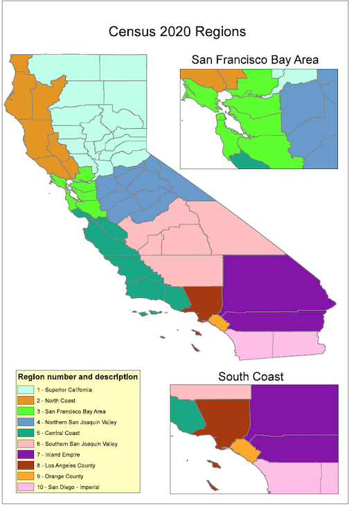

```{r setup, include=FALSE}
knitr::opts_chunk$set(echo = TRUE)
library(pheatmap)
library(dplyr)
library(lubridate)
library(ggplot2)
library(reshape2)
library(readr)
```

# Exploratory Data Analysis

## Loading CDC dataset
Load CDC dataset (subset where state is labelled CA):
```{r}
ca_covid <- read.csv("CA_combined_csv.csv", 
                     encoding = "UTF-8-BOM", 
                     na.strings=c('NA', '', 'Missing', 'N/A', 'Unknown'),
                     stringsAsFactors=TRUE)
```

## Cleaning Dataset 

Fixing data entry errors

Also add a column to indicate high risk cases (whether the patient died, was hospitalized, or was in the ICU)

Note that missing data is excluded for all of the diagrams

```{r}

#fix column name
names(ca_covid)[1] = "race_ethnicity_combined"

# combine upper case and lower case counties together
ca_covid$res_county = as.factor(toupper(ca_covid$res_county))

#remove observation with data entry error
ca_covid = ca_covid[-which(ca_covid$cdc_case_earliest_dt=="1960-09-29"),]

#change date variables from factors to dates
ca_covid$cdc_case_earliest_dt = as.Date(ca_covid$cdc_case_earliest_dt)
ca_covid$cdc_report_dt = as.Date(ca_covid$cdc_case_earliest_dt)

#fix data entry errors
ca_covid[which(ca_covid$res_county=="BERKELEY"),]$res_county = "ALAMEDA"
ca_covid[which(ca_covid$res_county=="LONG BEACH"),]$res_county = "LOS ANGELES"
ca_covid[which(ca_covid$res_county=="PASADENA"),]$res_county = "LOS ANGELES"

#list of counties in california
ca_counties = c("ALAMEDA", "ALPINE", "AMADOR", "BUTTE", "CALAVERAS",
                "COLUSA", "CONTRA COSTA", "DEL NORTE", "EL DORADO",
                "FRESNO", "GLENN", "HUMBOLDT", "IMPERIAL", "INYO",
                "KERN", "KINGS", "LAKE", "LASSEN", "LOS ANGELES",
                "MADERA", "MARIN", "MARIPOSA", "MENDOCINO", "MERCED",
                "MODOC", "MONO", "MONTEREY", "NAPA", "NEVADA", "ORANGE",
                "PLACER", "PLUMAS", "RIVERSIDE", "SARCRAMENTO", "SAN BENITO",
                "SAN BERNARDINO", "SAN DIEGO", "SAN FRANCISCO", "SAN JOAQUIN",
                "SAN LUIS OBISPO", "SAN MATEO", "SANTA BARBARA", "SANTA CLARA",
                "SANTA CRUZ", "SHASTA", "SIERRA", "SISKIYOU", "SOLANO", "SONOMA",
                "STANISLAUS", "SUTTER", "TEHAMA", "TRINITY", "TULARE",
                "TUOLUMNE", "VENTURA", "YOLO", "YUBA")
#remove non-CA counties
ca_covid = ca_covid[ca_covid$res_county %in% ca_counties, ]
ca_covid$res_county = droplevels(ca_covid$res_county)

#add column for high risk cases (if the case died, was hospitalized, or was in ICU)
ca_covid$high_risk = ifelse(ca_covid$hosp_yn=="Yes" |
                              ca_covid$death_yn=="Yes" |
                              ca_covid$icu_yn=="Yes", "Yes", "No")
ca_covid$high_risk = as.factor(ca_covid$high_risk)

```

## Cases by Month Line Plots

In terms of case numbers (not normalized with population of county), LA county has by far the greatest number of cases, deaths, and high risk patients

```{r}

# dataset to summarize cases/deaths/hosp/icu counts by county and month
cases_by_month = ca_covid %>% 
  group_by(res_county, month=floor_date(cdc_case_earliest_dt, "month")) %>%
  summarise(count=n(), deaths=sum(death_yn=="Yes", na.rm=TRUE),
            hosp=sum(hosp_yn=="Yes", na.rm=TRUE), 
            icu=sum(icu_yn=="Yes", na.rm=TRUE),
            high_risk=(sum(high_risk=="Yes", na.rm=TRUE)))

# load county population dataset and combine datasets
ca_pop <- read.csv("ca_population.csv")
names(ca_pop)[1] = "county"
ca_pop$Population = ca_pop$Population/100000
ca_pop$county = toupper(ca_pop$county)
cases_by_month = left_join(cases_by_month, ca_pop, by = c("res_county" = "county"))

#line plots

ggplot(cases_by_month, aes(x=month, y=count, group=res_county))+
  geom_line(aes(color=res_county))+
  geom_point()+
  ggtitle("Number of Cases vs. Month (by County)")+
  xlab("Month")+
  ylab("Cases")+ 
  theme(legend.title = element_text(size = 6), 
               legend.text = element_text(size = 6))

ggplot(cases_by_month, aes(x=month, y=deaths, group=res_county))+
  geom_line(aes(color=res_county))+
  geom_point()+
  ggtitle("Number of Deaths vs. Month (by County)")+
  xlab("Month")+
  ylab("Deaths")+ 
  theme(legend.title = element_text(size = 6), 
               legend.text = element_text(size = 6))

ggplot(cases_by_month, aes(x=month, y=hosp, group=res_county))+
  geom_line(aes(color=res_county))+
  geom_point()+
  ggtitle("Number of Hospitalizations vs. Month (by County)")+
  xlab("Month")+
  ylab("Hospitalizations")+ 
  theme(legend.title = element_text(size = 6), 
               legend.text = element_text(size = 6))

ggplot(cases_by_month, aes(x=month, y=icu, group=res_county))+
  geom_line(aes(color=res_county))+
  geom_point()+
  ggtitle("Number of ICU patients vs. Month (by County)")+
  xlab("Month")+
  ylab("Hospitalizations")+ 
  theme(legend.title = element_text(size = 6), 
               legend.text = element_text(size = 6))
```


## Heatmaps of Cases/Deaths/Hospitalizations/ICU by County and Month

Counts were divided by the population of the county. There are two noticeable peaks in July 2020 and December 2020, which correspond to the two big waves of COVID. After normalizing by population, LA county still has a high death/hospitalization/ICU rate. The peaks are not as apparent in the ICU heatmap which may be due to the large amount of missing data for this variable.

```{r}

#heatmap of cases/100,000 county population by county and month
pheatmap(xtabs(count/Population~res_county+month, cases_by_month), cluster_cols=FALSE, fontsize =6, main="Cases per 100,000 by County and Month")


#heatmap of deaths/100,000 people in county by county and month
pheatmap(xtabs(deaths/Population~res_county+month, cases_by_month), cluster_cols=FALSE, fontsize =6, main="Deaths per 100,000 by County and Month")

#heatmap of hospitalizations/100,000 people in county by county and month
pheatmap(xtabs(hosp/Population~res_county+month, cases_by_month), cluster_cols=FALSE, fontsize =6, main="Hospitalizations per 100,000 by County and Month")

#heatmap of icu patients/100,000 people in county by county and month
pheatmap(xtabs(icu/Population~res_county+month, cases_by_month), cluster_cols=FALSE, fontsize =6, main="ICU patients per 100,000 by County and Month")


```

## Heatmaps of Cases by Region and Month

In addition to county level differences, the differences in number of cases/deaths may be related to the geographic region the county belongs to. We classify counties based on the regions used in CA census:



From the heatmaps below we see that geographically close together regions tend to be clustered together and have similar case rates. For example, regions 2 and 3 (North Coast and Bay Area) tend to be close together in the hierarchical clustering, same with the counties that surround LA county. LA county is region 8 by itself and has very different rates compared to even surrounding regions.

```{r}
region = cbind(aggregate(cbind(count, deaths, hosp, icu, high_risk)~region+month, cases_by_month, sum), aggregate(Population~region, ca_pop, sum))

pheatmap(xtabs(count/Population~region+month, region), cluster_cols=FALSE, fontsize =6, main="Cases per 100,000 by Region and Month")
pheatmap(xtabs(deaths/Population~region+month, region), cluster_cols=FALSE, fontsize =6, main="Deaths per 100,000 by Region and Month")

pheatmap(xtabs(hosp/Population~region+month, region), cluster_cols=FALSE, fontsize =6, main="Hospitalizations per 100,000 by Region and Month")

pheatmap(xtabs(hosp/Population~region+month, region), cluster_cols=FALSE, fontsize =6, main="ICU patients per 100,000 by Region and Month")
```


## Total Case Rate and High Risk Case Rate vs % Population over 65 and % Rural Population

County case rate and county death rate in January 2021 appears to be negatively correlated with % county population over 65 and % county rural population. This relationship is much less apparent in months where COVID case rate is relatively low, such as in May 2020; it's only clearly seen during peaks of COVID wave such as July 2020 and December 2020-January 2021. The negative trend might be because COVID-19 is more readily spread by young people and in crowded, urban areas.

No apparent relationship between county case/death rates and median household income for any month

```{r}
ggplot(subset(cases_by_month, month=="2021-01-01"), aes(x=perc_rural, y=count/Population))+
  geom_point()+
  ggtitle("Cases per 100,000 County Population vs % County Rural Population (January 2021)") +
  xlab("% Rural Population")+
  ylab("Cases per 100,000")

ggplot(subset(cases_by_month, month=="2021-01-01"), aes(x=perc_over_65, y=count/Population))+
  geom_point()+
  ggtitle("Cases per 100,000 County Population vs % Over 65 in County (January 2021)") +
  xlab("% Age 65+ Population")+
  ylab("Cases per 100,000")

ggplot(subset(cases_by_month, month=="2021-01-01"), aes(x=perc_rural, y=deaths/Population))+
  geom_point()+
  ggtitle("Deaths per 100,000 County Population vs % County Rural Population (January 2021)")+
  xlab("% Rural Population")+
  ylab("Deaths per 100,000")

ggplot(subset(cases_by_month, month=="2021-01-01"), aes(x=perc_over_65, y=deaths/Population))+
  geom_point()+
  ggtitle("Deaths per 100,000 County Population vs % Over 65 Population (January 2021)")+
  xlab("% Age 65+ Population")+
  ylab("Deaths per 100,000")


# death vs percent rural plots for May 2020 (not during a COVID peak)

ggplot(subset(cases_by_month, month=="2020-05-01"), aes(x=perc_rural, y=deaths/Population))+
  geom_point()+
  ggtitle("Cases per 100,000 County Population vs % County Rural Population (May 2020)") +
  xlab("% Rural Population")+
  ylab("Cases per 100,000")

ggplot(subset(cases_by_month, month=="2020-05-01"), aes(x=perc_over_65, y=deaths/Population))+
  geom_point()+
  ggtitle("Deaths per 100,000 County Population vs % County Rural Population (May 2020)") +
  xlab("% Over 65 Population")+
  ylab("Cases per 100,000")

#income vs deaths (no apparent relationship)

ggplot(subset(cases_by_month, month=="2021-01-01"), aes(x=median_household_income, y=deaths/Population))+
  geom_point()+
  ggtitle("Deaths per 100,000 County Population vs Median Household Income (January 2021)")+
  xlab("% Age 65+ Population")+
  ylab("Cases per 100,000")

```


## Heatmaps of Cases/Deaths/Hospitalizations/ICU by Age and Month

Total case counts for a given age group and county were divided by population of the county. Most of the cases are among younger people, 20-39 year olds in particular, but most of the deaths are among older people

```{r}
cases_by_age = ca_covid %>% 
  group_by(res_county, age_group) %>%
  summarise(count=n(), deaths=sum(death_yn=="Yes", na.rm=TRUE),
            hosp=sum(hosp_yn=="Yes", na.rm=TRUE), 
            icu=sum(icu_yn=="Yes", na.rm=TRUE),
            high_risk=(sum(high_risk=="Yes", na.rm=TRUE)))
cases_by_age = left_join(cases_by_age, ca_pop, by = c("res_county" = "county"))

pheatmap(xtabs(count/Population~res_county+age_group, cases_by_age), cluster_cols=FALSE, fontsize =6, main="Cases per 100,000 County Population")

pheatmap(xtabs(deaths/Population~res_county+age_group, cases_by_age), cluster_cols=FALSE, fontsize =6, main="Deaths per 100,000 County Population")
```


Death/hospitalization/ICU counts were divided by the total number of cases for that age group in that county to get the death/hosp/ICU-to-case ratio. Among COVID cases, older patients (70+) are much more likely to die, be hospitalized, or go to the ICU across almost all counties. 


```{r}
pheatmap(xtabs(deaths/count~res_county+age_group, cases_by_age), cluster_cols=FALSE, fontsize =6, main="Deaths to Case Ratio by Age and County")

pheatmap(xtabs(hosp/count~res_county+age_group, cases_by_age), cluster_cols=FALSE, fontsize =6, main="Hospitalizations to Case Ratio by Age and County")

pheatmap(xtabs(icu/count~res_county+age_group, cases_by_age), cluster_cols=FALSE, fontsize =6, main="ICU to Case Ratio by Age and County")

```


```{r include=FALSE}

seniors = c("60 - 69 Years", "70 - 79 Years", "80+ Years")
senior_cases = cases_by_age[cases_by_age$age_group %in% seniors, ]
senior_cases = left_join(aggregate(cbind(count, deaths, hosp, icu, high_risk)~res_county, senior_cases, sum), ca_pop, by = c("res_county" = "county"))


```


#Race-Specific Rates by County

Counts of cases of a particular race in a county were divided by the population of that race in that county to get the race-specific rates. Note that Hispanic population was left out because the COVID-19 dataset has no patients marked Hispanic (might be data entry error?). Multiple/Other was also left out due to a lack of county population data for this race/ethnicity. 

```{r messages=FALSE}
county_race = read_csv("county race.csv")
county_race$county = toupper(county_race$county)

melt_race = melt(county_race)
names(melt_race)[3] = "racepop"
cases_by_race = ca_covid %>% 
  group_by(res_county, race_ethnicity_combined) %>%
  summarise(count=n(), deaths=sum(death_yn=="Yes", na.rm=TRUE),
            hosp=sum(hosp_yn=="Yes", na.rm=TRUE), 
            icu=sum(icu_yn=="Yes", na.rm=TRUE),
            high_risk=(sum(high_risk=="Yes", na.rm=TRUE)))

cases_by_race = left_join(melt_race, cases_by_race, by = c("county" = "res_county","variable" = "race_ethnicity_combined" ))
cases_by_race$variable = droplevels(cases_by_race$variable)
cases_by_race$region = ca_pop$region


pheatmap(xtabs(count/racepop*1000~county+variable, cases_by_race), cluster_cols=FALSE, fontsize =6, main="Race-Specific Case Rates per 1000 by County")
pheatmap(xtabs(deaths/racepop*1000~county+variable, cases_by_race), cluster_cols=FALSE, fontsize =6, main="Race-Specific Death Rates per 1000 by County")
pheatmap(xtabs(hosp/racepop*1000~county+variable, cases_by_race), cluster_cols=FALSE, fontsize =6, main="Race-Specific Hospitalization Rates per 1000 by County")
pheatmap(xtabs(icu/racepop*1000~county+variable, cases_by_race), cluster_cols=FALSE, fontsize =6, main="Race-Specific ICU Rates per 1000 by County")
```

## Race Specific Rates by Region

Same as above, but using region level race population numbers instead of county level

Native Hawaiian / Other PI and Black patients appear to have relatively high death/hosp/ICU rates in LA county

```{r}

race_region = left_join(aggregate(cbind(count, deaths, hosp, icu, high_risk)~region+variable, cases_by_race, sum), aggregate(racepop~region+variable, cases_by_race, sum))


pheatmap(xtabs(count/racepop*1000~region+variable, race_region), cluster_cols=FALSE, fontsize =6, main="Race-Specific Case Rates per 1000 by Region")
pheatmap(xtabs(deaths/racepop*1000~region+variable, race_region), cluster_cols=FALSE, fontsize =6, main="Race-Specific Death Rates per 1000 by Region")
pheatmap(xtabs(hosp/racepop*1000~region+variable, race_region), cluster_cols=FALSE, fontsize =6, main="Race-Specific Hospitalization Rates per 1000 by Region")
pheatmap(xtabs(icu/racepop*1000~region+variable, race_region), cluster_cols=FALSE, fontsize =6, main="Race-Specific ICU Rate per 1000 by Region")

```

